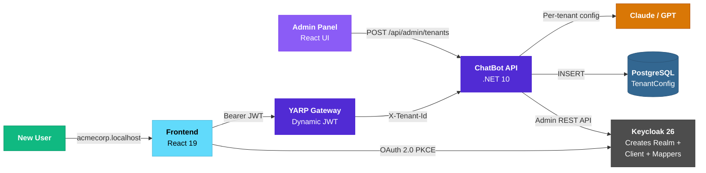
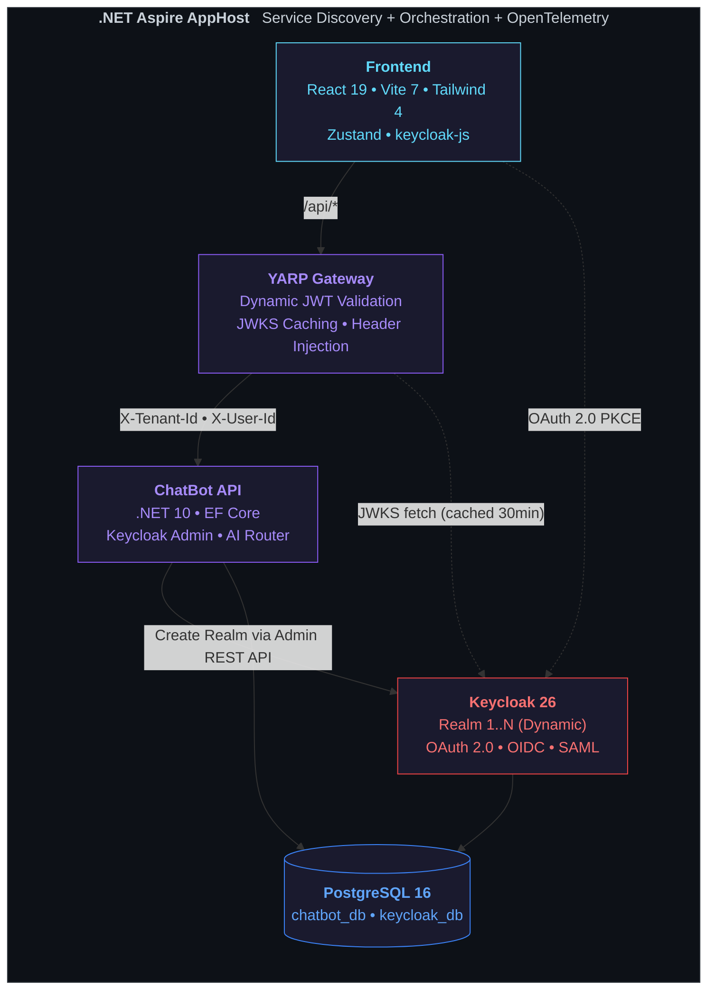
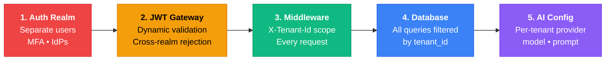

<div align="center">


# Enterprise Multi-Tenant AI Chatbot

### One click. New tenant. Zero code.

> **A reference architecture** for building multi-tenant SaaS applications with .NET Aspire.
>
> This project demonstrates how to combine **Keycloak** (identity), **YARP** (gateway), and **React** (frontend) to create a platform where new tenants — complete with their own authentication realm, users, roles, and AI chatbot — are provisioned with a single API call. No restarts. No config files. No deploys.
>
> Built as a showcase for **enterprise-grade multi-tenancy patterns** in the .NET ecosystem.

<br/>

[](https://dotnet.microsoft.com/)
[](https://learn.microsoft.com/en-us/dotnet/aspire/)
[](https://react.dev/)
[](https://www.keycloak.org/)
[](https://microsoft.github.io/reverse-proxy/)
[](https://www.postgresql.org/)
[](https://www.typescriptlang.org/)
[](https://tailwindcss.com/)
[](LICENSE)

</div>

<br/>

## What Does It Solve?

Building multi-tenant SaaS means solving the same problems over and over:

| Challenge | How This Project Handles It |
|:----------|:---------------------------|
| **"How do I onboard a new customer?"** | Admin Panel creates Keycloak realm + OAuth client + roles + user automatically |
| **"How do I isolate tenant data?"** | 5-layer isolation: Auth realm → JWT gateway → middleware → DB filter → AI config |
| **"How do I add Google/GitHub login?"** | Configure in Keycloak Admin Console. No code, no deploy. |
| **"How do I support different AI models per tenant?"** | Each tenant has its own provider (Claude/GPT), model, and system prompt |
| **"How do I validate JWTs from new tenants?"** | `DynamicJwksKeyResolver` fetches signing keys at runtime. No restart needed. |

<br/>

## Tenant Provisioning Flow



<br/>

## System Architecture



<br/>

## 5-Layer Tenant Isolation



<br/>

## Quick Start

```bash
# Prerequisites: .NET 10 SDK, Docker Desktop, Node.js 20+
dotnet workload install aspire

git clone <repository-url>
cd Enterprise-Multitenant-Chatbot/Enterprise-Multitenant-Chatbot

# Set at least one AI key
dotnet user-secrets set "Claude:ApiKey" "sk-ant-..."

# Launch everything
dotnet run
```

> Aspire Dashboard opens automatically — all services, logs, metrics, and distributed traces in one place.
> Frontend starts at **localhost:5173**

### Pre-configured Tenants

3 tenants are seeded on first run, each demonstrating a different security posture:

| Tenant | Security Profile | Color |
|:-------|:----------------|:------|
| **BasicCorp** | Enterprise — strict passwords, short sessions, 4-tier RBAC |  Blue |
| **SSOHub** | Tech Company — TOTP for admins, audit logging, 12hr sessions |  Green |
| **StartupXYZ** | Startup — self-registration, relaxed policy, 7-day sessions |  Amber |

### Create a New Tenant

1. Open **localhost:5173** → Click **Admin Panel**
2. Enter Tenant ID (e.g. `acmecorp`) and Display Name
3. Click **Create Tenant**
4. Navigate to **acmecorp.localhost:5173** → Login with Keycloak

<br/>

## Tech Stack

<table>
<tr>
<td width="33%">

### Backend
| | |
|:--|:--|
| .NET 10 | ASP.NET Core Minimal APIs |
| Aspire 13.1.2 | Orchestration + OTel |
| EF Core | PostgreSQL (Npgsql) |
| YARP 2.3.0 | Reverse Proxy + JWT |
| Anthropic SDK 4.0 | Claude AI |
| OpenAI SDK 2.2 | GPT Models |

</td>
<td width="33%">

### Frontend
| | |
|:--|:--|
| React 19 | TypeScript 5.9 |
| Vite 7.3 | Build + Dev Server |
| Tailwind CSS 4.2 | Utility-first CSS |
| Zustand 5.0 | State Management |
| keycloak-js 26.2 | OIDC Client |
| Axios | HTTP Client |

</td>
<td width="34%">

### Infrastructure
| | |
|:--|:--|
| Keycloak 26 | Multi-realm IAM |
| PostgreSQL 16 | Primary Database |
| Docker | Container Runtime |
| OpenTelemetry | Distributed Tracing |
| PgAdmin | DB Management |

</td>
</tr>
</table>

<br/>

## Why This Stack?

> **YARP** — Not just a proxy. It's the security boundary. JWT validation, header injection, and routing — all in one place. Built on Kestrel for maximum performance.

> **Keycloak** — Enterprise IAM that scales. Each realm is a complete identity silo: users, roles, MFA, social login, LDAP federation. The Admin REST API makes it fully automatable.

> **Aspire** — The modern alternative to docker-compose. Automatic service discovery, health checks, and an OpenTelemetry dashboard that actually helps you debug distributed systems.

> **Together** — YARP validates tokens from Keycloak, injects tenant context, and the API never touches authentication logic. Add a tenant, add a realm, add Google login. No restarts. No deploys. Just works.

---

<div align="center">

<br/>

**Multi-tenancy shouldn't require a deploy.**

<br/>

Made with .NET Aspire, Keycloak, React, and a belief that SaaS onboarding should be instant.

<br/>

[](LICENSE)

</div>
